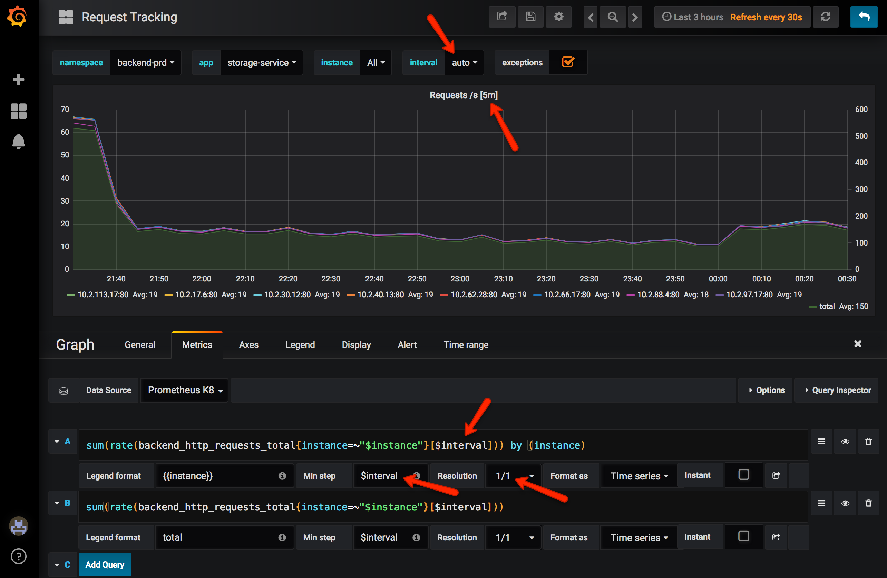
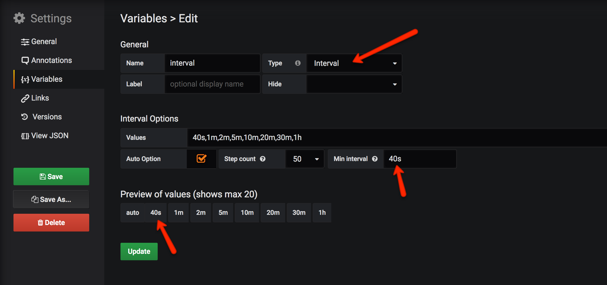
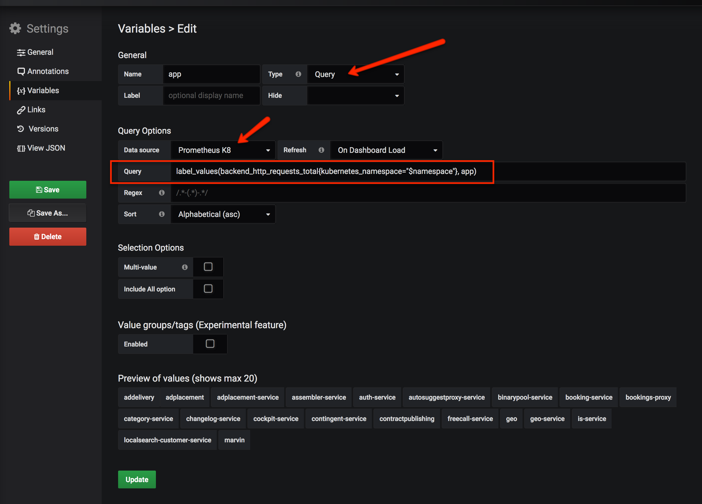

# Prometheus @Backend

---

## What is Prometheus?

+++
@title[Prometheus]
Prometheus is an open-source systems monitoring and alerting toolkit base on purely numeric time series.
<br>
<br>
"Cloud Native Computing Foundation" member project
<br>
<br>
https://prometheus.io

+++

### Why Prometheus?

> a single big Prometheus server can easily store millions of time series, with a record of 800,000 incoming samples per second [...]. Given a 10-seconds scrape interval and 700 time series per host, this allows you to monitor over 10,000 machines from a single Prometheus server.

<span style="font-size:0.6em;">https://prometheus.io/blog/2016/07/23/pull-does-not-scale-or-does-it/#it-doesn-t-matter-who-initiates-the-connection</span>

+++

#### Very flexible multi dimensional data model

---

## Concepts

+++

### Timeseries

Stream of samples of the same metric and the same set of labels

#### Sample
[a float64 value, a millisecond-precision timestamp]

+++

### Scraping (Pulling)

Pulling metrics via HTTP from /metrics<br>
<br>
...every 16s

+++

#### Why Pull?

@ul

- Simple client implementation
- No client configuration
- No performance overhead on the client as they only update counters
- Easy debugging on the client (with your browser)
- Immediately notice when a target is down

@ulend

+++

#### Events vs. state
Prometheus collects the *state* and *not single events* (like the count of http requests and not the single requests).

---

## Timeseries

+++

### Metric Naming 

`<namespace>_<subsystem>_my_metric_name_<unit>`<br>
<br>
`backend_http_requests_total`<br>
<span style="font-size:0.6em;">(with `backend` as namespace)</span><br>
<br>
`backend_auth_authentication_success_total`<br>
<span style="font-size:0.6em;">(with `backend` as namespace and `auth` as subsystem)</span>

+++

##### Use base units (seconds, not milliseconds)
Add a suffix describing the unit<br>
<br>
`backend_http_response_time_seconds`<br>
`backend_http_requests_total`<br>
`process_cpu_seconds_total`<br>

<span style="font-size:0.6em;">https://prometheus.io/docs/practices/naming/</span>

+++

### Labels

Labels makes the timeseries multidimensional<br>
<span style="font-size: 0.6em">
`backend_auth_users_activated_total{platform="Android"}`<br>
`backend_http_requests_total{method="GET", path="/users", app="user-service"}`
</span>

> backend_http_requests_total *fans out* by method, path and app

<span style="color: maroon">Remember that every unique combination of key-value label pairs represents a new time series</span>

+++

### Auto labels
Some labels are added automatically like<br>
`app`, `instance`, `kubernetes_namespace`, `job` etc.

---

## Metric Types

+++

##### Counter
##### Gauge
##### Histogram
##### Summary

+++

### Counter

A single numerical value that only ever goes up

+++

### Gauge

A single numerical value that can arbitrarily go up and down.

+++

### Histogram

Samples observations (usually things like request durations or response sizes) and counts them in configurable buckets

+++

### Summary

Summaries calculate streaming φ-quantiles on the client side

+++
### Histogram details
A histogram called `backend_http_response_time_seconds` with the buckets `0.01, 0.02, 0.04, 0.1, 0.2, 0.4, 1, 5` will be represented as:
<span style="font-size:0.6em;">
`backend_http_response_time_seconds_bucket{..., le="0.01"}`<br>
`backend_http_response_time_seconds_bucket{..., le="0.02"}`<br>
...<br>
`backend_http_response_time_seconds_bucket{..., le="5"}`<br>
`backend_http_response_time_seconds_bucket{..., le="+Inf"}`<br>
<br>
`backend_http_response_time_seconds_count{...}`<br>
`backend_http_response_time_seconds_sum{...}`<br>
</span>

---

## PromQL

+++

#### Instant vector
A single sample value at a given timestamp (instant)<br>
<br>
<span style="font-size: 0.6em">
`backend_http_requests_total`<br>
`backend_http_requests_total{app="auth-service"}`
</span>

+++
@title[Instant vector example]

|Element | Value |
|--------|-------|
|backend_http_requests_total{app="auth-service", instance="10.0.0.1"} | 100 |
|backend_http_requests_total{app="auth-service", instance="10.0.0.2"} | 200 |

+++

#### Range vector
Samples in a given timerange<br>
<br>
<span style="font-size: 0.7em">
`backend_http_requests_total{app="auth-service"}[1m]`
</span>

+++
@title[Range vector example]

|Element | Value |
|--------|-------|
|backend_http_requests_total{app="auth-service", instance="10.0.0.1"} | 10 @ 1527286717.149<br>12 @ 1527286733.149<br>13 @ 1527286749.149<br>20 @ 1527286765.149 |
|backend_http_requests_total{app="auth-service", instance="10.0.0.2"} | 2 @1527286711.47<br>5 @1527286727.47<br>9 @1527286743.47<br> |

+++
##### rate()
`rate(v range-vector)`:<br>
Per second increase of the given range vector<br>(*of a counter!*)<br>
<br>
e.g. `rate(backend_http_requests_total{app="storage-service"}[5m])`
+++
##### sum()
`sum(v instance-vector)`:<br>
calculate sum over dimensions/labels<br>

+++
##### sum() by()

`sum(backend_http_requests_total{app="my-service"}) by (instance)`:

|Element | Value |
|--------|-------|
|{instance="10.0.0.1"} | 123 |
|{instance="10.0.0.2"} | 134 |

+++

##### sum() without()

`sum(backend_http_requests_total{app="my-service"}) without (instance)`:

|Element | Value |
|--------|-------|
|{app="my-service",method="GET",path="/places"} | 123 |
|{app="my-service",method="POST",path="/places"} | 29 |
|{app="my-service",method="GET",path="/customers"} | 4673 |
|{app="my-service",method="GET",path="/categories"} | 7373 |

---

## What shall I measure?

+++

### The Four Golden signals
Latency, Traffic, Errors, Saturation
<br>
<br>
<span style="font-size:0.6em;">https://landing.google.com/sre/book/chapters/monitoring-distributed-systems.html</span>

+++

### Latency
The time it takes to service a request.
<br>
<br>
Distinguish between GET vs. POST and successful vs. failed requests.

+++

### Traffic
HTTP requests per second

+++

### Error
The *ratio* of requests that fail (500s)

+++

### Saturation
How "full" your service is.

+++

### Latency example
We use a histrogram with the labels:<br>
`method`, `path`:<br>
<br>
`backend_http_response_time_seconds`

```
sum(rate(backend_http_response_time_seconds_sum{app="storage-service"}[1m]))
/
sum(rate(backend_http_response_time_seconds_count{app="storage-service"}[1m]))
```

+++

### Traffic example
We use a histrogram with the labels:<br>
`method`, `path`, `status`:<br>
<br>
`backend_http_requests_total`

```
sum(rate(backend_http_requests_total{app="storage-service"}[1m]))
```

+++

### Error example
The *ratio* of requests that fail (500s)

```
sum(rate(backend_http_requests_total{app="storage-service", status=~"^5[0-9][0-9]$"}[1m]))
/
sum(rate(backend_http_requests_total{app="storage-service"}[$interval]))
```

---

## Grafana

+++

### Grafana Settings


+++

### Interval label


+++

### Label values
